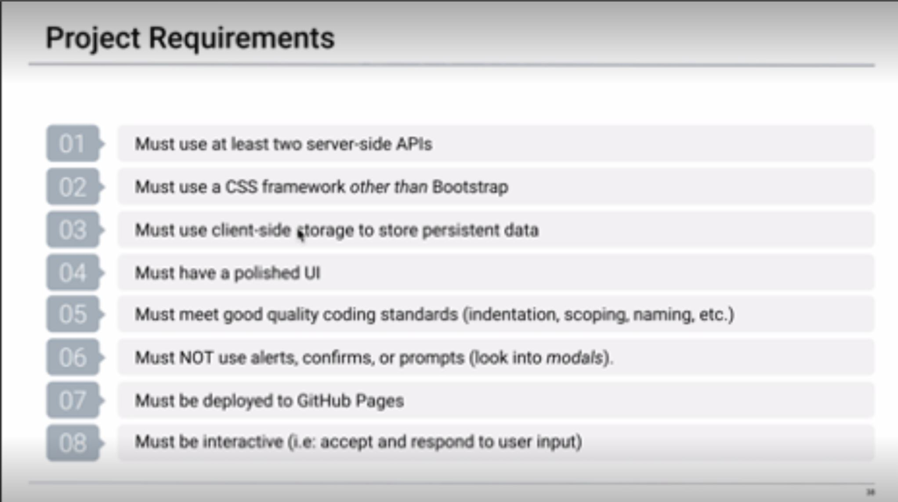
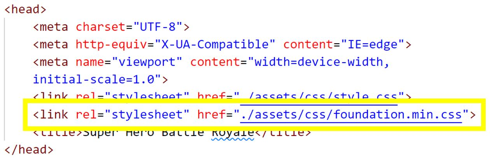

# Project-One: Marvel vs DC

This assignment had the following acceptance criteria. This README will show how each of these criteria was met.

**Requirement One: “Use CSS framework other than Bootstrap.”**

The below image shows that we used the Foundation CSS framework to help setup our CSS code quickly. 

**Requirement Two: “Be deployed to GitHub Pages.**

**Requirement Three: “Be interactive.”**

**Requirement Four: “Use at least two server-side APIs.”**

**Requirement Five: “Does not use alerts, confirms, or prompts.”**

**Requirement Six: “Use client-side storage to store persistent data.”**

**Requirement Seven: “Be responsive.”**

**Requirement Eight: “Have a polished UI.”**

**Requirement Nine: “have a clean repository that meets quality coding standards.”**

**Requirement Ten: “Have a quality README.”**

**Links:**

[GitHub Repo]( https://github.com/AWonka/Project1-Hero-VS)

[Deployed Application]( https://awonka.github.io/Project1-Hero-VS/)

